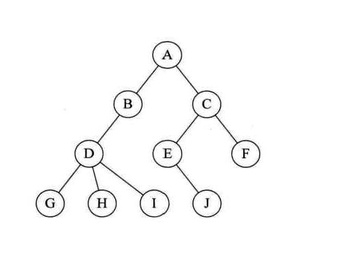
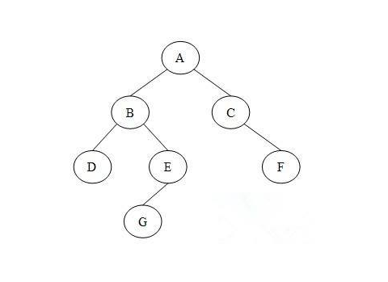
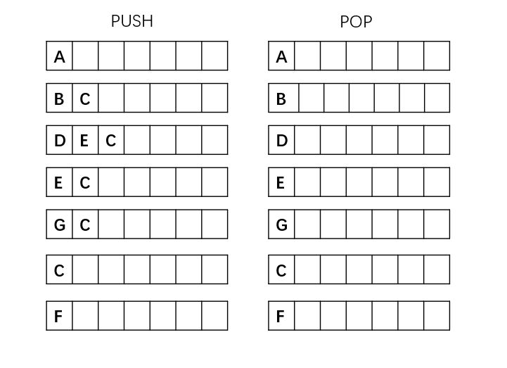
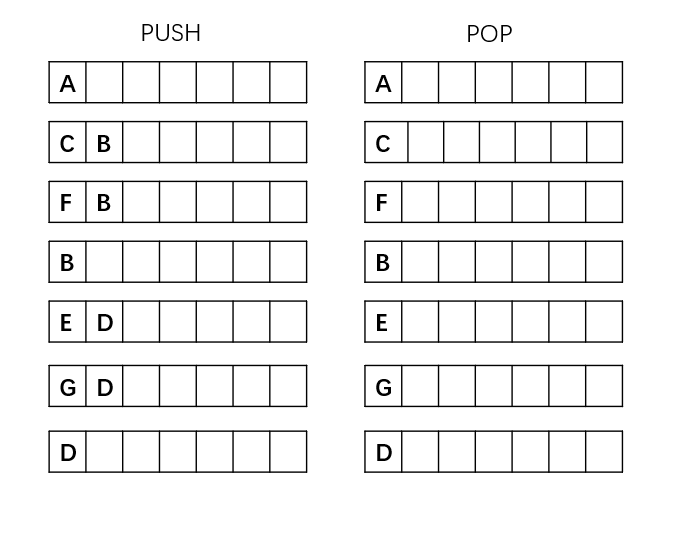

# 关于二叉树的遍历，你要的都在这

###   树的概括

####   树

  什么是树，树是数据结构中的一个基础类型，是包含n（n>=0）个结点的有穷集，由这 n 个节点组成一个具有层次关系的集合，因为其可视化形状像一颗倒立的树，所以被称为树。树的节点可以分为父节点和子节点，一个父节点可以对应 m (m>=0) 个子节点，子节点只有一个父节点，最顶部的节点被称为根节点或者树根。一个结点含有的子结点的个数称为该结点的度，度为 0 的称为叶子节点或终端节点。除了根结点外，每个子结点可以分为多个不相交的子树，所以也可以说树是由根结点和若干颗子树构成的。树的层次是指从根节点开始，根节点那一层为 1，根节点的子节点的那一层为 2 ，跟的子节点的的子节点那一层 为 3，以此类推。而树的高度或深度为树的最大层级。



  其中 A 为根节点，F、G、H、I、J 为叶子节点，树的高度为 3。

#### 二叉树

  那么什么是二叉树呢，就是每个节点最多有两个子节点，且子节点有序的树，二叉树的子节点分为左节点和右节点。



  树是一个集合，那么我们肯定就有需要遍历它的方法，二叉树的遍历一般分为前序遍历、中序遍历、后序遍历、广度优先遍历、深度优先遍历。

### 树的遍历

#### 遍历介绍

  二叉树的前序、中序、后序都是指的遍历二叉树时父节点的遍历位置，而左节点永远是在右节点的前面。

  **前序遍历 (DLR)** 指遍历整棵树时，首先访问根结点然后遍历左子树，最后遍历右子树。在遍历左、右子树时，仍然先访问根结点，然后遍历左子树，最后遍历右子树。上图二叉树的前序遍历为 ABDEGCF。

  **中序遍历 (LDR)** 指遍历整棵树时，首先遍历根节点的左子树，再访问根节点，最后遍历右子树。在遍历左、右子树时，仍然先遍历根节点的左子树，再访问根节点，最后遍历右子树。上图二叉树的中序遍历为 DBGEACF。

  **后序遍历 (LRD)** 指遍历整棵树时，首先遍历根节点的左子树，再遍历右子树，最后访问根节点。在遍历左、右子树时，仍然先遍历根节点的左子树，再遍历右子树，最后访问根节点。上图二叉树的后序遍历为 DGEBFCA。

  **广度优先遍历**是指从根节点开始，一层一层的遍历，遍历完一层才遍历下一层。上图二叉树的广度优先遍历为 ABCDEFG。

  **深度优先遍历**是指尽可能遍历树的层级，从根节点开始，先遍历子节点，再遍历兄弟节点 (根节点没有兄弟节点)，遍历子树时，也是先遍历子节点，再遍历兄弟节点，一直重复发现所有节点，而且二叉树的深度优先遍历也是先遍历左子树再遍历右子树。上图二叉树的深度优先遍历为 ABDEGCF。

#### 代码表示

二叉树的表示

```java
public class TreeNode {
        int val; // 值
        TreeNode left; // 左节点
        TreeNode right; // 右节点

        TreeNode(int x) {
            val = x;
        }
    }
```

##### 前序遍历

###### 递归：

  递归的方法还是比较简单，我们只需要先输出根节点，然后先传入根节点的左子树，再传入右子树。访问左子树的时候也是先输出左子树父节点，在访问左子树时，也是先传入左子树的左子树，再传入左子树的右子树。只有等根节点的左子树全部输出完成后，根节点的右子树才会访问，达到前序遍历的目的。

```java
    private List<Integer> treeList = new ArrayList<>();
    public List<Integer> getTree(TreeNode root){

        if (root != null){
            treeList.add(root.val);
            getTree(root.left);
            getTree(root.right);
        }
        
        return treeList;
    }
```

###### 非递归：

  非递归的就需要使用到数据结构栈，栈我们都知道是一种先进后出的数据结构。那为什么栈可以帮我们前序遍历二叉树呢？我们可以在遍历每一个节点的时候先弹出栈顶元素，然后把右节点压入栈，再把左节点压入栈：


  以上图为例，我们从根节点开始，压入栈中，然后循环先弹出栈顶节点，再分别压入弹出的节点的右节点和左节点：



```java
public List<Integer> getTreeList(TreeNode root){
        Stack<TreeNode> stack = new Stack<>();
        List<Integer> out = new ArrayList<>();

        if (root == null){
            return out;
        }

        stack.push(root);
        while (stack.size() != 0){
            TreeNode node = stack.pop();
            out.add(node.val);
            if (node.right != null){
                stack.push(node.right);
            }
            if (node.left != null){
                stack.push(node.left);
            }
        }
        return out;

    }
```

##### 中序遍历

###### 递归：

  递归的中序遍历和前序遍历一样，不过换了一下输出的位置

```java
private List<Integer> treeList = new ArrayList<>();
    public List<Integer> getTree(TreeNode root){

        if (root != null){
            getTree(root.left);
            treeList.add(root.val);
            getTree(root.right);
        }
        
        return treeList;
    }
```

###### 非递归：

  那我们非递归要怎么执行中序遍历呢？都知道中序遍历第一个访问的点是最左侧的叶子结点，所以每一次我们都需要把当前节点压入栈中，一直压到当前树或者子树最左侧叶子节点为止，然后弹出栈顶节点，然后再将弹出节点的右子树重复上面的操作，直到遍历完成。那么为什么要要弹出节点，然后对右子树进行操作呢？如果栈顶元素为叶子结点（以节点 D 为例），没有右子树，那么循环中就不会再压入节点，而是再次弹出栈顶元素 B。中序遍历我们说过了，是先遍历左子树，再遍历父节点，再遍历右子树，子树也是相同的遍历操作。对于节点 B 而言，弹出了 D 和 B 也就是已经遍历了左子树和父节点。那么就应该用同样的操作遍历 B 的右子树，当 B 的右子树遍历完成，没有元素可以压入，就会持续弹出到 A，再遍历 A 的右子树，这样元素就可以遍历完成了。


```java
public List<Integer> getTreeList(TreeNode root){

        Stack<TreeNode> stack = new Stack<>();
        List<Integer> out = new ArrayList<>();

        if (root == null){
            return out;
        }

        while (root != null || stack.size() != 0){
            while (root!= null){
                stack.push(root);
                root = root.left;
            }

            root = stack.pop();
            out.add(root.val);
            root = root.right;
        }

        return out;

    }
```

##### 后序遍历

###### 递归：

递归的后序遍历和前序、中序一样，都是换一下输出顺序

```java
private List<Integer> treeList = new ArrayList<>();
    public List<Integer> getTree(TreeNode root){

        if (root != null){
            getTree(root.left);
            getTree(root.right);
            treeList.add(root.val);
        }
        
        return treeList;
    }
```

###### 非递归：

  非递归的后序遍历可以参考前序遍历，后序遍历子树时，父节点总是最后访问的，我们可以参考前序遍历，再前序遍历时我们会把弹出的节点元素依次加到 List 中，那么我们可以在后序遍历中将每次弹出的元素放到 List 最前面，那么在 List 中，子树的根节点是不是就到了最后遍历的呢？


  但是这样会有一个问题了，这样遍历出来的后序遍历就和前序遍历完全相反，这样我们遍历出来就是右子树在左子树前面了，那肯定是有问题的。那我们要怎么保证左子树在右子树前面呢？既然我们是倒着插入到 List 中，那我们压入栈中就先压左子树，再压右子树就可以了。



  这样 POP 出来的结果正好就是后序遍历的倒置：

```java
public List<Integer> getTreeList(TreeNode root){

        Stack<TreeNode> stack = new Stack<>();
        List<Integer> out = new ArrayList<>();

        if (root == null){
            return out;
        }
        stack.add(root);
        while (stack.size() != 0){
            root = stack.pop();
            out.add(0,root.val);
            if (root.left != null){
                stack.add(root.left);
            }

            if (root.right != null){
                stack.add(root.right);
            }
        }

        return out;

    }
```

##### 广度优先遍历

  广度优先遍历我们使用的就是队列了，因为队列是先进先出。我们先压入根节点，然后每次循环都弹出队列头部节点，然后再压入弹出节点的左右节点。


  如图我们先将 A 压入队列，弹出 A，压入 B、C，这样 B 就在队列头部，我们再弹出 B 压入 D、E，现在队列为 C、D、E，我们再弹出 C 压入 F。到现在为止我们遍历顺序为 A、B、C，队列元素为 D、E、F，我们再按照这样继续循环下去，就可以实现二叉树的广度优先遍历。

```java
public List<Integer> getTreeList(TreeNode root){

        Queue<TreeNode> outQu = new LinkedList<>();
        List<Integer> out = new ArrayList<>();

        if (root == null){
            return out;
        }

        outQu.add(root);

        while (!outQu.isEmpty()){
            TreeNode node = outQu.poll();
            if (node.left != null){
                outQu.offer(node.left);
            }

            if (node.right != null){
                outQu.offer(node.right);
            }
        }

        return out;

    }
```

##### 深度优先遍历

  其实吧，二叉树的深度优先遍历结果和前序遍历结果一模一样，不信你去看上面，又可以少学一部分了。

Fine 啦，就先到这了。你学废了吗？

