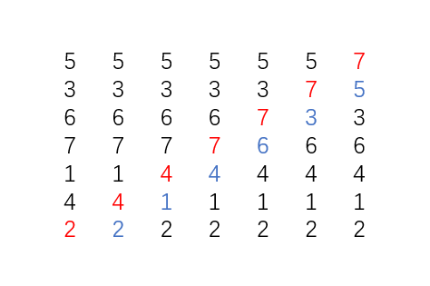
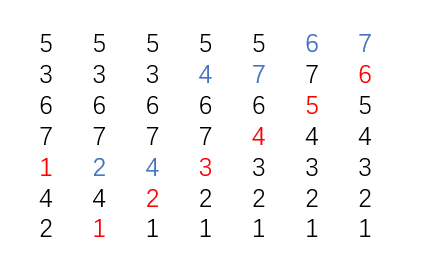
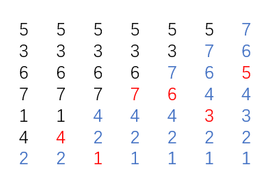
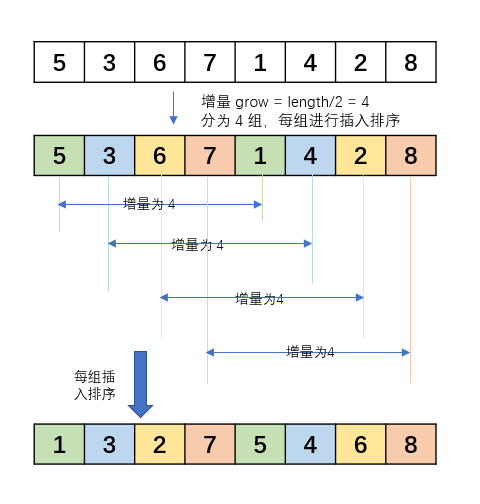
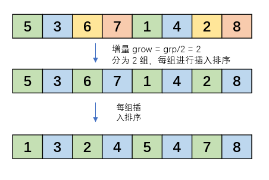
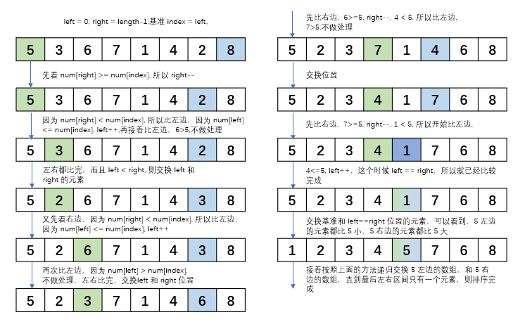

# 常问的几个基础排序，要不再复习一下？

  排序，不管是日常开发还是面试中，都会被光顾，虽然现在 jdk 的集合中提供了排序的方法，但是我们也得去熟悉一些基础的排序算法，这里笔者给大家分享五个常问的基础排序，冒泡、选择、插入、希尔、快排。

### 冒泡排序

  冒泡排序，顾名思义就是排序元素时像冒泡一样，把最大或者最小慢慢比较到数组尾部，实现排序的方法。具体就是，如果有一个长度为 n 的数组 num，将 num[0] 与 num[1] 比较，如果 num[0] > num[1] ，则交换位置，反之则不交换。再比较 num[1] 和 num[2], 根据大小决定位置，一直交换到数组结束。那么 num[n-1] 一定是数组中最大的。再次做上述比较，那么 num[n-2] 一定是第二大的，一直循环直到整个数组排序完成。 下图只展示冒第一个泡。



```java
public int[] order(int[] num){
        if (num.length == 0){
            return null;
        }

        // -1 是因为我们比较 i 和 i+1，防止数组越界
        for (int i = 0; i < num.length -1 ; i++) {
            // 因为第 num.length - i 到 num.length 的数字肯定是排序好的
            // 所以只用比到 num.length - i
            for (int j = 0; j < num.length - i - 1 ; j++) {
                if (num[j]>num[j+1]){
                    int temp = num[j];
                    num[j] = num[j+1];
                    num[j+1] = temp;
                }
            }
        }

        return num;
    }
```

### 选择排序

  选择排序，就是第一次选择数组中最小的与第一个交换，第二次选择第二小的与第二个元素交换，直到交换到最后一个。



```java
public int[] order(int[] num){
        if (num.length == 0){
            return null;
        }

        for (int i = 0; i < num.length; i++) {
            int minIndex = i;
            // 因为前 i 位肯定是排序好的，所以只需要从 i 位开始找
            for (int j = i; j < num.length ; j++) {
                if (num[j] < num[minIndex]){
                    minIndex = j;
                }
            }
            int temp = num[i];
            num[i] = num[minIndex];
            num[minIndex] = temp;

        }
        return num;
    }
```

### 插入排序

  插入排序是从拿第二个元素开始，与左边的元素挨个比较，找到比自己大的元素放，然后把自己放到该元素左边，如果没有就不换位置，再从第三个元素开始，直到排序完成。



```java
public int[] order(int[] num){
        if (num.length == 0 || num.length == 1){
            return num;
        }
        
        for (int i = 1; i < num.length; i++) {
            int changeIndex = i;
            for (int j = i; j > 0; j--) {
                if (num[changeIndex] < num[changeIndex - 1]){
                    int temp = num[changeIndex];
                    num[changeIndex] = num[changeIndex-1];
                    num[changeIndex-1] = temp;
                    changeIndex--;
                }else {
                    // 因为是从选择元素的左边第一个开始比较
                    // 左边已经排序完成，如果选择元素大于已经要比较的元素可以直接退出比较
                    break;
                }
            }
        }
        return num;
    }
```

### 希尔排序

  什么是希尔排序呢？希尔排序是插入排序的改进版，我们可以看到，上面的插入排序在什么时候排序会比较快呢？首先，和所有排序一样，元素的个数少时，还有呢？我们可以看到，当数组基本有序时，那么插入排序就会更快。所以希尔排序是什么改进的呢？希尔排序将数组按照增量分割成若干个小组，利用插入排序完成排序，然后变小增量，再次分割并排序（这里的分割只是逻辑上的分割，并没有真正将数组分成几个新的数组）。下面来详细说一下：



  先解释一下，增量为每组数组两个元素之间下标差值，一般来说第一次增量为数组长度的一半，第二次分组的增量为上次的增量的一半，一直到增量为 1。可以看到，第一次分组插入排序后，每组有序，数组大致有序，我们再接着分组：



  如果再次分组的话，grow = grow/2 = 1，这样的增量为1，就不需要分组了，我们可以看到现在的数组比原数组有序多了，使用现在的数组比进行插入排序会比原数组快很多。

  代码表示（其实就是分组使用插入排序）：

```java
public int[] order(int[] num){
        if (num.length == 0 || num.length == 1){
            return num;
        }

        for (int grow = num.length/2; grow > 0 ; grow/=2) {
            for (int j = grow; j < num.length; j++) {
                int k = 1;
                int changeIndex = j;
                while (j - grow * k >= 0){
                    if (num[changeIndex] < num[changeIndex - grow]){
                        int temp = num[changeIndex];
                        num[changeIndex] = num[changeIndex - grow];
                        num[changeIndex - grow] = temp;
                        changeIndex -= grow;
                    }else {
                        // 因为是每组元素从选择元素的左边第一个开始比较
                        // 左边已经排序完成，如果选择元素大于已经要比较的元素可以直接退出比较
                        break;
                    }
                    k++;
                }
            }
        }
        return num;
    }
```

### 快速排序

  快速排序就是我们经常听到的快排，那么快排是怎么对数组进行排序的呢？快排中有比较重要的三个变量，基准、左指针，右指针。基准一般是数组的第一个元素，左指针指第一个元素，右指针指最后一个元素，分别从左右指针指的元素与基准比较，比基准大的放右边，比基准小的放左边。这样到最后，就会找到一个数，这个数的左边都比这个数小，右边都比这个数大，然后再递归按照上面的方法分别遍历这个数的左区间和右区间，一直遍历到左右区间只有一个数时，则排序完成。具体见下图：



  接着递归左区间和右区间，左区间的基准元素为 1，左指针元素为 1，右指针元素为 4，右区间的基准元素为 7，左指针元素为 7，右指针元素为 8，一直递归到所有的子左区间和子右区间元素个数为 1，则排序完成。具体代码如下：

```java
public int[] order(int[] num){
        if (num.length == 0 || num.length == 1){
            return num;
        }
        sort(num,0,num.length-1);
        return num;
    }

public void sort(int[] num,int l,int r){
        // 证明左右区间元素为 1
        if (l > r){
            return;
        }

        // 因为 l，r 还需要给左右区间确定范围，所以使用临时变量移动指针
        int index = l,left = l,right=r;

        while (left < right){
            // 先比较右边
            while (num[index]<=num[right] && left<right){
                right--;
            }
            // 再比较左边
            while (num[index]>=num[left] && left<right){
                left++;
            }
            if (left<right){
                int temp = num[left];
                num[left] = num[right];
                num[right] = temp;
            }
        }

        // 交换基准元素
        int temp = num[index];
        num[index] = num[left];
        num[left] = temp;
        index = left;
        // 递归左区间
        sort(num,l,index-1);
        // 递归右区间
        sort(num,index+1,r);
 }
```

  几个常问的基础排序就先分享到这了，喜欢的话点个 star，谢谢啦。