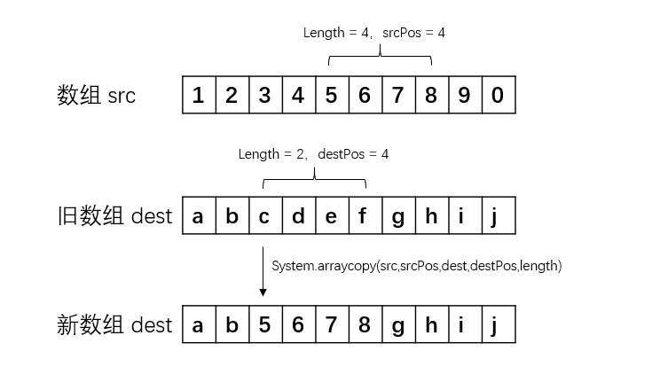

# ArrayList 源码分析

  ArrayList 是 Java 中比较常用的集合之一。它实现了 List<E>, RandomAccess, Cloneable, java.io.Serializable 这四个接口，List<E> 接口是为了让 ArrayList 去实现 List 的各种方法，实现 RandomAccess 是为了让 ArrayList 支持快速快速随机访问，实现 Cloneable 是为了让 ArrayList 支持 clone() 方法，实现 Serializable 是为了让 ArrayList 支持序列化。

  上面实现的 List 和 Serializable 接口可能大家都没什么疑惑，但是 RandomAccess  和 Cloneable 呢？我们看 RandomAccess  和 Cloneable  的源码，发现这两个接口都是空的。


其实这两个空的接口都是标记型接口，什么意思呢？就是来标记一个类是否属于使用快速随机访问个 clone() 方法的标记。

比如标记型接口是怎么标记是否可以使用快速随机访问的呢？在集合类 Collections 中我们可以看到：


是否实现了 RandomAccess  接口使用的搜索方法是不一样的。那么 Cloneable 的标记呢？我们知道 clone() 方法是 Object 类的，所以直接来看 Object 的源码：


  我们看到了，如果没有实现 Cloneable 接口而使用 clone() 方法的话是会抛出 CloneNotSupportedException。所以类似于 RandomAccess 和 Cloneable 这样没有实体的接口在 Java 中被称为标记型接口，用来标记一个类或者接口。

## 主要参数

  接下来我们看一下 ArrayList 的主要参数：

```java
// ArrayList 的默认容量
private static final int DEFAULT_CAPACITY = 10;

// 这是一个空数组，用来初始化真正保存数据的数组
private static final Object[] EMPTY_ELEMENTDATA = {};

// 这个也是空数组，用来初始化的，它与上面的空数组的不同在源码中解释如下
// We distinguish this from EMPTY_ELEMENTDATA to know how much to inflate when first 
// element is added.
// 我们将此与EMPTY_ELEMENTDATA区别开来，以了解添加第一个元素时要充气多少。
private static final Object[] DEFAULTCAPACITY_EMPTY_ELEMENTDATA = {};

// ArrayList 中用来真正保存数组的 Object 数组
transient Object[] elementData;

// ArrayList 中保存的元素数量
private int size;
```

##  构造方法

 接下来我们看一下 ArrayList 的构造方法，ArrayList 有三个构造方法：

```java
// 传入一个容量
public ArrayList(int initialCapacity) {
        // 容量大于 0，就新建一个大小为容量的 Object 数组
        if (initialCapacity > 0) {
            this.elementData = new Object[initialCapacity];
        } else if (initialCapacity == 0) {
            // 等于 0 就初始化为参数空数组
            this.elementData = EMPTY_ELEMENTDATA;
        } else {
            // 要不就抛出一个异常
            throw new IllegalArgumentException("Illegal Capacity: "+
                                               initialCapacity);
        }
    }

// 不传入容量时，则初始化为第二个空数组
public ArrayList() {
        this.elementData = DEFAULTCAPACITY_EMPTY_ELEMENTDATA;
    }

// 传入一个集合
public ArrayList(Collection<? extends E> c) {
        // 数组就为集合转数组
        elementData = c.toArray();
        if ((size = elementData.length) != 0) {
            // 元素数量不为 0
            // c.toArray might (incorrectly) not return Object[] (see 6260652)
            if (elementData.getClass() != Object[].class)
                // 如果类型不为 Object 数组，则使用 copyof
                elementData = Arrays.copyOf(elementData, size, Object[].class);
        } else {
            // replace with empty array.
            // 元素数量为 0，则替换为空数组 
            this.elementData = EMPTY_ELEMENTDATA;
        }
    }
```

  我们来看一下 Arrays 中的 copyof 干了啥？

```java
public static <T,U> T[] copyOf(U[] original, int newLength, Class<? extends T[]> newType) {
        @SuppressWarnings("unchecked")
        // 如果原来的数组是 Object 数组就返回 Object 数组，如果不为 Object 数组，则返回一个传入的新         // 类型的数组 
        T[] copy = ((Object)newType == (Object)Object[].class)
            ? (T[]) new Object[newLength]
            : (T[]) Array.newInstance(newType.getComponentType(), newLength);
        System.arraycopy(original, 0, copy, 0,
                         Math.min(original.length, newLength));
        return copy;
    }
```

  我们看到在 ArrayList 的第三个构造方法中，传入的新类型也是 Object，所以它这里调用 Arrays.copyof 是为了将 elementData 转为 Object 数组。

## add()、set()、get()

 在集合类中，get()、和 add() / set() / put() 无疑是最重要的几个方法，我们先来看看 ArrayList 中的 add() 方法，ArrayList 中有两个 add() 方法：

```java
// 将元素添加到数组末尾
public boolean add(E e) {
        // 该方法我们通过方法名就可以看出是为了确保内部容量足够，下面会讲到
        ensureCapacityInternal(size + 1);  // Increments modCount!!
        // 然后将元素 e 存入 size++ 位置
        elementData[size++] = e;
        return true;
    }
```

  在看第二个 add() 方法之前，我们需要先看一下 System.arraycopy() 这个方法：

```java
@FastNative
    public static native void arraycopy(Object src,  int  srcPos,
                                        Object dest, int destPos,
                                        int length);
```

  这个方法在源码中是一个 native 方法，是一个快速拷贝数组的方法，这个方法是指我们将数组 src 从位置 srcPos 开始，拷贝到从 destPos 位置开始的数组 dest 中，一共拷贝 length 个元素：



  现在我们可以来看看第二个 add() 方法了：

```java
// 将元素添加到数组固定位置
public void add(int index, E element) {
        // 插入的 index 是不能比 size 大，比 0 小
        if (index > size || index < 0)
            throw new IndexOutOfBoundsException(outOfBoundsMsg(index));
        // 确保内部容量足够
        ensureCapacityInternal(size + 1);  // Increments modCount!!
        System.arraycopy(elementData, index, elementData, index + 1,
                         size - index);
        // 数组 index 位置的元素为 element
        elementData[index] = element;
        // 数组元素数量 ++
        size++;
    }
```

 

  那我们 ArrayList 中调用的 System.arraycopy(elementData, index, elementData, index + 1,size - index) 其实就是把数组 elementData 中的数组从 index 位往后移一位。

  ArrayList 还提供了 set() 方法：

```java
public E set(int index, E element) {
        if (index >= size)
            throw new IndexOutOfBoundsException(outOfBoundsMsg(index));

        E oldValue = (E) elementData[index];
        // 将 index 的元素换成新元素
        elementData[index] = element;、
        // 返回旧元素
        return oldValue;
    }
```

ArrayList 的 get() 比较简单，就是返回了数组中指定 index 的元素：

```java
public E get(int index) {
        if (index >= size)
            throw new IndexOutOfBoundsException(outOfBoundsMsg(index));

        return (E) elementData[index];
    }
```

## ArrayList 中的扩容

  在上面的 add() 方法中，我们看到了有一个保证内部容量的方法 ensureCapacityInternal()，那这个方法具体是怎么样的呢？

```java
// minCapacity 为要保证内部容量的最低值，add() 方法中为 size+1
private void ensureCapacityInternal(int minCapacity) {
        // 判断保存元素的数组是不是为空数组
        if (elementData == DEFAULTCAPACITY_EMPTY_ELEMENTDATA) {
            // 是空数组就取传入值与默认容量的最大值
            minCapacity = Math.max(DEFAULT_CAPACITY, minCapacity);
        }
        // 那这个方法又是干什么呢？
        ensureExplicitCapacity(minCapacity);
    }
```

```java
private void ensureExplicitCapacity(int minCapacity) {
        // 这个是数组更改结构的次数，不用在意
        modCount++;

        // overflow-conscious code
       // 我们需要的大小已经大于数组的容量了，就需要扩容了
        if (minCapacity - elementData.length > 0)
            grow(minCapacity);
    }
```

```java
private void grow(int minCapacity) {
        // overflow-conscious code
        // 获取旧容量
        int oldCapacity = elementData.length;
        // 新容量等于 旧容量 + 旧容量 * 2
        int newCapacity = oldCapacity + (oldCapacity >> 1);
        if (newCapacity - minCapacity < 0)
            // 如果新容量大于需要的值，就等于需要的值
            newCapacity = minCapacity;
        if (newCapacity - MAX_ARRAY_SIZE > 0)
            // 如果新容量已经大于数组最大元素容量，就按这个方法取
            newCapacity = hugeCapacity(minCapacity);
        // minCapacity is usually close to size, so this is a win:
        // 然后换成新的容量大小的数组
        elementData = Arrays.copyOf(elementData, newCapacity);
    }
```

  而 hugeCapacity() 这个方法是给 ArrayList 取极限值容量的：

```java
private static int hugeCapacity(int minCapacity) {
        if (minCapacity < 0) // overflow
            throw new OutOfMemoryError();
        // 需要的值大于 MAX_ARRAY_SIZE 就取 Integer.MAX_VALUE，否则取 MAX_ARRAY_SIZE
        // 其中 MAX_ARRAY_SIZE = Integer.MAX_VALUE - 8
        return (minCapacity > MAX_ARRAY_SIZE) ?
            Integer.MAX_VALUE :
            MAX_ARRAY_SIZE;
    }
```

## 再看看 remove() 方法

  ArrayList 中的 remove() 方法也有两个，我们先来看看第一个：

```java
// 通过下标移除元素
public E remove(int index) {
        if (index >= size)
            throw new IndexOutOfBoundsException(outOfBoundsMsg(index));

        modCount++;
        // 拿到旧元素
        E oldValue = (E) elementData[index];
        // 移除元素过后数组需要移动距离，size - index - 1，就是 index 后面所有的元素
        int numMoved = size - index - 1;
        if (numMoved > 0)
            // 这个方法上面已经说过，在这里呢，主要是将数组后 numMoved 个元素向前移一位
            System.arraycopy(elementData, index+1, elementData, index,
                             numMoved);
        // 将 index 为 size -1 的元素也就是最后一个元素置为空，并且元素个数减一
        elementData[--size] = null; // clear to let GC do its work
        // 返回旧元素
        return oldValue;
    }
```

我们再看看第二个方法：

```java
// 通过元素移除移除元素，返回是否操作成功
public boolean remove(Object o) {
        // 如果元素为空
        if (o == null) {
            // 遍历所有元素
            for (int index = 0; index < size; index++)
                if (elementData[index] == null) {
                    // 找到空元素，快速移除
                    fastRemove(index);
                    return true;
                }
        } else {
            // 要移除的元素不为空，遍历所有元素
            for (int index = 0; index < size; index++)
                if (o.equals(elementData[index])) {
                    // 找到元素，快速移除
                    fastRemove(index);
                    return true;
                }
        }
        return false;
    }
```

那么快速移除是怎么具体实现呢？

```java
// 我们可以看到，fastRemove() 方法与第一个 remove() 方法差不多一样的
private void fastRemove(int index) {
        modCount++;
        int numMoved = size - index - 1;
        if (numMoved > 0)
            System.arraycopy(elementData, index+1, elementData, index,
                             numMoved);
        elementData[--size] = null; // clear to let GC do its work
    }
```

## 总结

  通过这次的 ArrayList 源码分析，我们可以看到 ArrayList 的查询是非常快的，但是增删都比较慢，add() 如果是直接添加到末尾还好说，如果添加到中间，数组后面的元素是全部需要移动的，而删除时，不管是哪种方式，都是需要移动数组，就导致增删比较慢。当然这里的慢一般是比较少见的，平时我们使用的场景的数组元素的个数一般来说是感受不到这种快慢的，但是呢，我们了解了其内部结构过后我们也可以按照场景选择不同的集合类了。

好了，ArrayList 的源码就分享到这里了，如果想要一起学习的话，可以持续关注这个 [GitHub项目](https://github.com/YoungTime/CodeShare)，或者关注我的个人微信公众号。


  觉得喜欢的话请给我这个 [GitHub 项目](https://github.com/YoungTime/CodeShare) 一个 Star，谢谢！