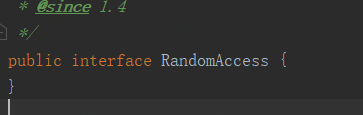
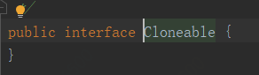
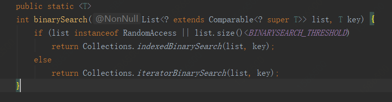
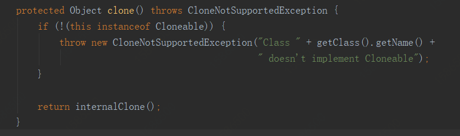

# ArrayList 源码分析

  ArrayList 是 Java 中比较常用的集合之一。它实现了 List<E>, RandomAccess, Cloneable, java.io.Serializable 这四个接口，List<E> 接口是为了让 ArrayList 去实现 List 的各种方法，实现 RandomAccess 是为了让 ArrayList 支持快速快速随机访问，实现 Cloneable 是为了让 ArrayList 支持 clone() 方法，实现 Serializable 是为了让 ArrayList 支持序列化。

  上面实现的 List 和 Serializable 接口可能大家都没什么疑惑，但是 RandomAccess  和 Cloneable 呢？我们看 RandomAccess  和 Cloneable  的源码，发现这两个接口都是空的。





其实这两个空的接口都是标记型接口，什么意思呢？就是来标记一个类是否属于使用快速随机访问个 clone() 方法的标记。

比如标记型接口是怎么标记是否可以使用快速随机访问的呢？在集合类 Collections 中我们可以看到：



是否实现了 RandomAccess  接口使用的搜索方法是不一样的。那么 Cloneable 的标记呢？我们知道 clone() 方法是 Object 类的，所以直接来看 Object 的源码：



  我们看到了，如果没有实现 Cloneable 接口而使用 clone() 方法的话是会抛出 CloneNotSupportedException。所以类似于 RandomAccess 和 Cloneable 这样没有实体的接口在 Java 中被称为标记型接口，用来标记一个类或者接口。

  接下来我们看一下 ArrayList 的主要参数：

```java
// ArrayList 的默认容量
private static final int DEFAULT_CAPACITY = 10;

// 这是一个空数组，用来初始化真正保存数据的数组
private static final Object[] EMPTY_ELEMENTDATA = {};

// 这个也是空数组，用来初始化的，它与上面的空数组的不同在源码中解释如下
// We distinguish this from EMPTY_ELEMENTDATA to know how much to inflate when first 
// element is added.
// 我们将此与EMPTY_ELEMENTDATA区别开来，以了解添加第一个元素时要充气多少。
private static final Object[] DEFAULTCAPACITY_EMPTY_ELEMENTDATA = {};

// ArrayList 中用来真正保存数组的 Object 数组
transient Object[] elementData;

// ArrayList 中保存的元素数量
private int size;
```

  接下来我们看一下 ArrayList 的构造方法，ArrayList 有三个构造方法：

```java
// 传入一个容量
public ArrayList(int initialCapacity) {
        // 容量大于 0，就新建一个大小为容量的 Object 数组
        if (initialCapacity > 0) {
            this.elementData = new Object[initialCapacity];
        } else if (initialCapacity == 0) {
            // 等于 0 就初始化为参数空数组
            this.elementData = EMPTY_ELEMENTDATA;
        } else {
            // 要不就抛出一个异常
            throw new IllegalArgumentException("Illegal Capacity: "+
                                               initialCapacity);
        }
    }

// 不传入容量时，则初始化为第二个空数组
public ArrayList() {
        this.elementData = DEFAULTCAPACITY_EMPTY_ELEMENTDATA;
    }

// 传入一个集合
public ArrayList(Collection<? extends E> c) {
        // 数组就为集合转数组
        elementData = c.toArray();
        if ((size = elementData.length) != 0) {
            // 元素数量不为 0
            // c.toArray might (incorrectly) not return Object[] (see 6260652)
            if (elementData.getClass() != Object[].class)
                // 如果类型不为 Object 数组，则使用 copyof
                elementData = Arrays.copyOf(elementData, size, Object[].class);
        } else {
            // replace with empty array.
            // 元素数量为 0，则替换为空数组 
            this.elementData = EMPTY_ELEMENTDATA;
        }
    }
```

  我们来看一下 Arrays 中的 copyof 干了啥？

```java
public static <T,U> T[] copyOf(U[] original, int newLength, Class<? extends T[]> newType) {
        @SuppressWarnings("unchecked")
        // 如果原来的数组是 Object 数组就返回 Object 数组，如果不为 Object 数组，则返回一个传入的新         // 类型的数组 
        T[] copy = ((Object)newType == (Object)Object[].class)
            ? (T[]) new Object[newLength]
            : (T[]) Array.newInstance(newType.getComponentType(), newLength);
        System.arraycopy(original, 0, copy, 0,
                         Math.min(original.length, newLength));
        return copy;
    }
```

  我们看到在 ArrayList 的第三个构造方法中，传入的新类型也是 Object，所以它这里调用 Arrays.copyof 是为了将 elementData 转为 Object 数组。

  在集合类中，get()、和 add() / set() / put() 无疑是最重要的几个方法

