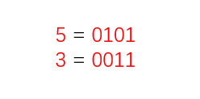
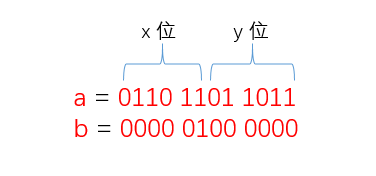
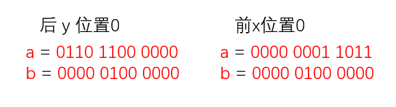
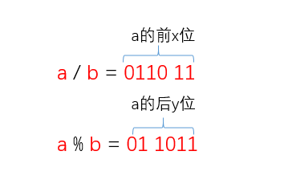
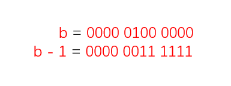

# HashMap 源码中高闪代码

  HashMap 源码中有很多的东西是值得我们去认真琢磨的，这里笔者就分享其中的一些超级棒的地方，当然还有更多的地方值得大家去努力探寻。

## 2 的整数次幂与 (n-1) & hash 

  在笔者的 [HashMap 源码解析](https://github.com/YoungTime/CodeShare/blob/master/JDK-Code/HashMap%20%E6%BA%90%E7%A0%81%E8%A7%A3%E8%AF%BB.md) 中说到了，HashMap 中规定了，数组 table 的容量以及扩容值都必须为 2 的整数次幂。在 HashMap 中，元素 Node 在数组中的位置是 hash 对数组容量取余，也就是 hash % n，而且也说到了 (n-1) & hash 相当于 hash % n，这样的好处我们当然一眼就能看出来，位运算肯定是比取余要快，那为什么当 n 为 2 的整数次幂时，(n-1) & n 就等于 hash % n？我们来看一下。

  要明白为什么这两个作用相等，其实主要是明白取余在二进制上意味着什么，如果是 a % b（HashMap 中 a 与 b 都为 int 整数），那么就是说整数 a 可以分为多少个整数 b 后，并且还能剩余的整数。如果是一个随机的整数，换算成 2 进制时，完全不知道会有多少个 1，多少个 1，怎么可能在二进制中非常明了的取余是什么呢？比如我们取 5 % 3：

   

  如果大家只看二进制，能够看出 0101 % 0011 等于多少吗？当然是很不容易直接看出来的。当然大家不要想着 10 进制里面的 5 % 3 = 2，要不然你就是在为难我胖虎。

  那么怎么样才能在二进制快速找到一个数的余数呢？只要我们的 b 的二进制表示只有一个 1 不就行了？看图：

  这样看 a % b 是不是一下子就明了，知道 a / b 和 a % b 的值是什么了。啥？还是不知道？

  a 的前面 x 位等于有多少个 b，a 的后 y 位表示 a % b 为多少。我们分别将 a 的前 x 位置为 0，和后 y 位置为 0：

  所以说，如果当 b 为 2 的整数次幂，我们要得出 a % b 的值，就是找到 a 的后 y 位的值，那怎么找到呢？我们知道位运算的一个常识，1 与任何数为任何数，0 与任何数为 0。所以如果我们要得到 a 的后 y 位，只要用一个前 x 位全为 0，后 y 位全为 1 的数来和 a 做与运算就可以得到 a 的后 y 位，那这个数是什么呢？正好就是 b - 1。

  所以当 b 为 2 的整数次幂时， a % b 就等于 (b - 1) & a，也就是 HashMap 中的 hash % n = (n - 1) & hash。

## HashMap 中的扩容

   在[HashMap 源码解析](https://github.com/YoungTime/CodeShare/blob/master/JDK-Code/HashMap%20%E6%BA%90%E7%A0%81%E8%A7%A3%E8%AF%BB.md) 中已经对于 HashMap 的扩容做了一个分享，我们知道 HashMap 扩容时，根据 e.hash & oldCap 来判断将原来的链表放入到哪一个新的链表中，并且将两个链表的头指针一个放入了 table[j]，一个放入了 table[j + oldCap]。

  作为 JDK 8 的源码，这里用作判断 e.hash & oldCap 和链表头指针的位置肯定不是随意写的，这个原因我在[HashMap 源码解析](https://github.com/YoungTime/CodeShare/blob/master/JDK-Code/HashMap%20%E6%BA%90%E7%A0%81%E8%A7%A3%E8%AF%BB.md) 也已经讨论过了，这里可以结合上面的内容再说一下。

  oldCap 在扩容中是指 HashMap 在扩容前的容量，也就是原来的 n，上面说到了 (n-1) & hash 是取 hash 的后 y 位，那么 n & hash 呢？很明显，是取 hash 的第 y + 1 位。

  我们看，如果 hash 的第 y +1 位为 0，那么 n & hash 就等于 0，如果 hash 的第 y + 1 位为 1，那么 n & hash 就等于 n。而在 HashMap 源码中，扩容时，如果 n & hash == 0，那么就把 Node 放入 lo 链表，如果 n & hash ！= 0，那么就把 Node 放入 hi 链表，其中 lo 链表的头指针是放入 table[j]，hi 链表是放入 table[j + oldCap]。

  HashMap 中找下标的方式就是 (n - 1) & hash，也就是 hash % n，也就是等于 hash 的后 y 位的值，那么扩容后的下标呢？就等于 (2*n - 1) & hash，也就是 hash % (2 * n)，也就是等于 hash 的后 y + 1 位的值，那么距离差为什么呢？距离差就是 hash 的后 y + 1 位的值减去 hash 的后 y 位的值，那么不就等于 hash 的 y + 1 位的值吗？如果 hash 值的 y + 1 位为 0，那么距离差就为 0，如果 hash 值的 y + 1 位为 1，那么距离差就为 n，也就是 oldCap。那就对应着 table[j] 和 table[j + oldCap]。

  你看，是不是很巧妙呢？其实源码中还有很多巧妙的地方等着我们去发现，大家一起努力探寻，努力学习吧。

   好了，HashMap 源码中的高闪地方就先说到这里，如果想要一起学习的话，可以持续关注这个项目，或者关注我的个人微信公众号。

  觉得喜欢的话请给我一个 Star，谢谢！